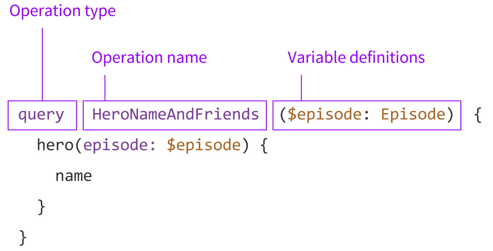
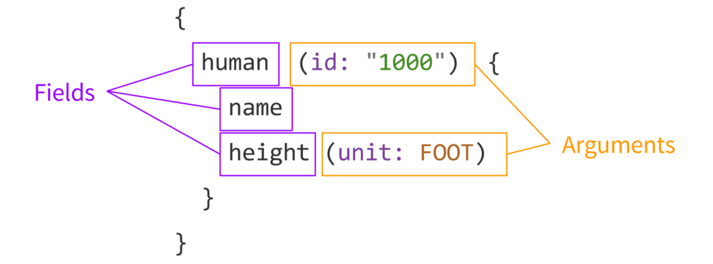

refs: https://medium.freecodecamp.org/so-whats-this-graphql-thing-i-keep-hearing-about-baf4d36c20cf

# The Basics
In a nutshell, GraphQL is a syntax that describes ***how to ask for data***, and is generally used to load data from a server to a client. GraphQL has three main characteristics:

- It lets the client specify exactly what data it needs.
- It makes it easier to aggregate data from multiple sources.
- It uses a type system to describe data.
Queries
The request you make to your GraphQL personal assistant is the query, and it looks something like this:

query {
  stuff
}
We’re declaring a new query using the query keyword, then asking for a field named stuff. The great thing about GraphQL queries is that they support nested fields, so we can go one level deeper:k
## 3 Main : Schema , Query , Resolver 

### Queries [ Ask For Data ]
- ### Anatomy




- ### Basic
```
query {
  stuff
}
```
```
query {
  posts { # this is an array
    title
    body
    author { # we can go deeper!
      name
      avatarUrl
      profileUrl
    }
  }
}
```
- ### support arguments
```
query {
  post(id: "123foo"){
    title
    body
    author{
      name
      avatarUrl
      profileUrl
    }
  }
}
```
- ### naming & variable
```
query getMyPost($id: String) {
  post(id: $id){
    title
    body
    author{
      name
      avatarUrl
      profileUrl
    }
  }
} 
```

We’re declaring a new query using the query keyword, then asking for a field named stuff. The great thing about GraphQL queries is that they support nested fields, so we can go one level deeper: