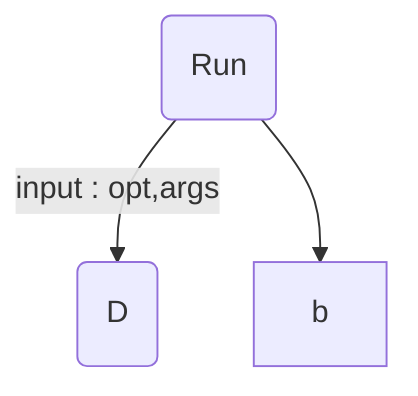

##exercise

Command Line Argument 2 ข้อความ โดยข้อความที่ 1 มีค่าเป็น vowel / alphabet (ไม่นับตัวที่เป็นสระ) / digit / lowercase / uppercase อย่างใดอย่างหนึ่ง ข้อความที่ 2 เป็น alphanumeric และแสดงจำนวนตัวอักษร ในข้อความที่ 2 ตามที่ข้อความที่ 1 กำหนด ทาง Standard Output

****
##How to (***using python***)
****

opt = vowel / alphabet / digit / lowercase / uppercase
args = alphanumeric

["vowel","alphabet","digit","lowercase","uppercase"]